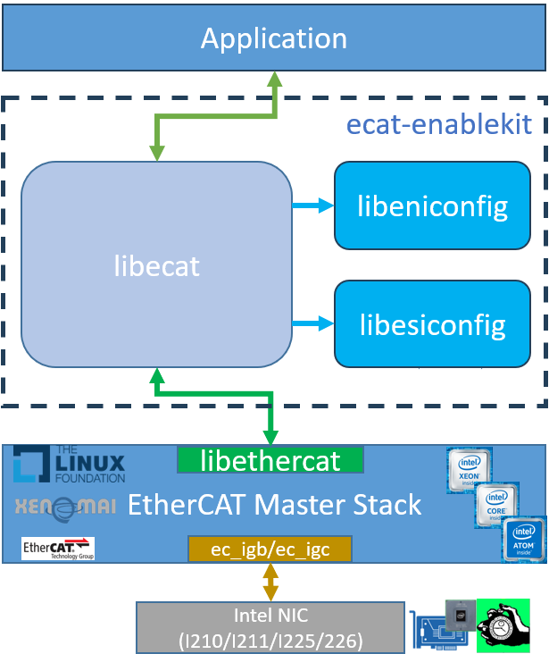

# Ecat EnableKit
## Overview

Ecat EnableKit streamlines the configuration and development of EtherCAT systems by offering a comprehensive set of tools and APIs. It simplifies the setup of EtherCAT masters, slaves, and network topology, allowing developers to focus on application logic rather than low-level configuration details. With Ecat EnableKit, building robust EtherCAT applications becomes faster and more efficient.

## Features

* Built on the IgH EtherCAT Master Stack
* Supports both Preempt-RT and Xenomai/Dovetail real-time frameworks
* Provides utilities to parse EtherCAT Network Information (ENI) files
* Includes tools for parsing EtherCAT Slave Information (ESI) files
* Offers user-friendly APIs for rapid EtherCAT application development
* Supplies example code for controlling EtherCAT IO slaves
* Includes example code for operating EtherCAT CoE slaves (SOE currently not supported)

## Architecture Overview

The architecture is as following:

Three key blocks have been introduced to support the core architecture:
* **libecat** is a dynamic library that provides a set of public APIs for EtherCAT applications. It enables developers to control EtherCAT slaves using information defined in the EtherCAT ENI file, which describes slave configurations and network topology. The library abstracts low-level details, making it easier to develop and manage EtherCAT-based systems.
* **libeniconfig** is a static library that parses EtherCAT ENI (EtherCAT Network Information) files compliant with the ETG.2100 specification. It extracts detailed information about network topology, device initialization commands, and cyclic data exchange, enabling applications to easily interpret and utilize ENI file contents for EtherCAT system configuration.
* **libesiconfig** is a static library for parsing EtherCAT ESI (EtherCAT Slave Information) files compliant with the ETG.2000 specification. It extracts comprehensive device descriptions provided by EtherCAT slave vendors, enabling applications to access detailed information about slave capabilities and configuration options.

## Getting Started

### Requirements
The software runs on standard PCs or servers. Since it is primarily developed in C, porting to other operating systems is straightforward.

### Running 

Please check [README](./../README.md) file for details.

### Examples

Two examples using Ecat EnableKit are provided.

* [IO Example](./../examples/ecatdio/single_io_ecat.c): Demonstrates how to configure an EtherCAT IO device using an ENI file. The example covers master initialization, IO device configuration, and setting up a cyclic real-time thread for data exchange.
* [Motor Example](./../examples/ecatmotor/single_motor_vel.c): Illustrates the setup of a servo motor device from an ENI file. It includes master creation, motor slave configuration, and implementation of a cyclic real-time thread for velocity control.

## License

The source code is licensed under LGPL License 2.1. See [COPYING](./../COPYING) file for details. 

